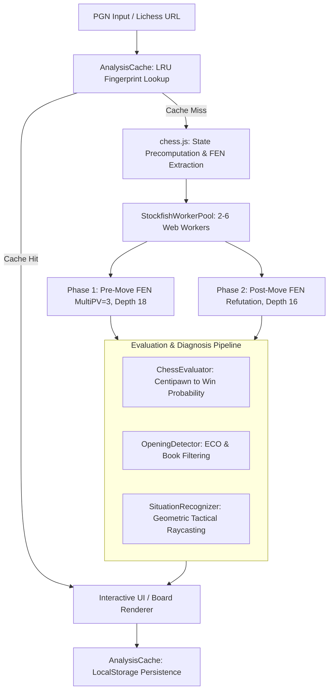

# WhyBlunder

WhyBlunder is an in-browser, zero-backend chess game analyzer. It runs a parallelized pool of WebAssembly-compiled Stockfish engine workers directly on the client to classify move quality, detect tactical patterns, and generate human-readable explanations without server infrastructure.

Traditional chess analysis platforms route game evaluations to centralized server queues, introducing network latency, rate limits, infrastructure operating costs, and subscription walls. WhyBlunder offloads the entire computational pipeline (UCI engine evaluation, win-probability modeling, tactical pattern recognition, and variation tree parsing) to client Web Workers.


---

## Architecture & Data Flow

WhyBlunder executes an asynchronous, client-side analysis pipeline:



---

## Core Mechanisms

### 1. Multi-Worker Parallel Engine Pool (`js/browser-analyzer.js`)

WhyBlunder bypasses single-threaded WebAssembly bottlenecks by running an asynchronous worker pool configured to the host machine's hardware concurrency:

```javascript
// Worker pool sizing heuristic
const concurrency = navigator.hardwareConcurrency || 4;
const poolSize = Math.max(2, Math.min(concurrency >= 4 ? concurrency - 1 : concurrency, 6));
const pool = new StockfishWorkerPool(poolSize);
```

- **Hash & MultiPV Allocation**: Each worker initializes Stockfish with a 32 MB hash table (`setoption name Hash value 32`) and searches 3 principal variations (`setoption name MultiPV value 3`).
- **Two-Phase Ply Dispatch**:
  1. **Phase 1 (Pre-move)**: Dispatches the pre-move FEN at `depth 18` across idle workers. If the played move matches MultiPV line 1, evaluation is complete.
  2. **Phase 2 (Post-move refutation)**: If the played move was suboptimal and missing from MultiPV lines 2–3, WhyBlunder triggers a targeted search of the post-move FEN at `depth 16` to calculate the opponent's precise refutation line.
- **Safety Timeout**: Workers enforce an explicit 20-second execution cap per position to prevent hung WASM processes on complex endgames.

### 2. Win Probability & Move Classification (`js/chess-evaluator.js`)

Engine centipawn scores ($cp$) are converted to winning probabilities ($WP \in [0.0, 1.0]$) using a standard logistic model centered at zero:

$$WP = \frac{1}{1 + 10^{-cp / 400}}$$

Mate scores are mapped to a bounded centipawn scale: $cp = \text{sign}(m) \times (10000 - 10 \cdot |m|)$ for mate in $m$ moves.

| Classification | Condition / Win Probability Drop ($\Delta WP$) | Fallback Safeguard |
| :--- | :--- | :--- |
| **Brilliant** | Played move is best $\land$ Piece Sacrifice $\land\ WP_{after} \ge 0.60$ | N/A |
| **Great / Best** | Played move is best $\land$ ($\text{isOnlyMove} \lor \Delta WP \le 0.01$) | N/A |
| **Book** | Move sequence matches ECO database ($\le \text{ply } 16$) | N/A |
| **Inaccuracy** | $0.04 \le \Delta WP < 0.10$ | Downgraded from mistake in winning conversions ($WP > 0.90$) |
| **Mistake** | $0.10 \le \Delta WP < 0.22$ | N/A |
| **Blunder** | $\Delta WP \ge 0.22 \lor (\text{Missed Win: } WP_{before} \ge 0.85 \land WP_{after} < 0.55)$ | Prevents false blunders when simplifying at $WP \ge 0.95$ with $\Delta WP < 0.15$ |

### 3. Tactical Situation Recognizer (`js/situation-recognizer.js`)

Rather than showing raw engine output, WhyBlunder applies 64-square raycasting and attack graphs to extract concrete chess concepts:

- **Tactical Forks**: Scans piece attacks to detect simultaneous threats against higher-value or undefended targets; filters out capturable attackers via `isPieceSafe()`.
- **Pins & Skewers**: Traces sliding attack rays (Queen, Rook, Bishop) through intermediate targets to King or high-value pieces.
- **Hanging Pieces**: Identifies unprotected pieces moved to attacked squares or abandoned defenders.
- **Positional Patterns**: Detects center pawn duos (`d4`/`e4`), open file rook control, 7th-rank infiltration, true outposts, and castling forfeits.

```javascript
// Example structured output schema from SituationRecognizer
{
  flaw: "leaves the bishop hanging on e6, which allows dxe6 capturing the exposed piece",
  missedChance: "missed winning the enemy Queen with Rxd4",
  betterLine: "Bc4 was much better because it maintains the active diagonal",
  tags: ["Hanging Piece", "Tactical Fork", "Center Control"]
}
```

### 4. Client-Side LRU Cache (`js/analysis-cache.js`)

Analyses persist in `localStorage` under `whyblunder_analysis_cache_v1`:

- **Fingerprint Normalization**: Strips headers, PGN comments (`{}`), variations (`()`), NAGs (`$N`), and clock stamps before generating a base-36 hash key.
- **LRU Eviction**: Caps storage at 5 full game analyses. When quota exceptions occur, the cache automatically truncates the oldest 50% of entries.
- **Lichess URL / ID Resolving**: Directly retrieves cached evaluations for game IDs (e.g., `https://lichess.org/Qa7FJNk2`).

---

## Architectural Trade-offs

| Design Choice | Approach Chosen | Alternative Approach | Technical Trade-off |
| :--- | :--- | :--- | :--- |
| **Engine Execution** | In-browser WebAssembly Web Workers | Backend server cluster (e.g., Celery + Stockfish binary) | Eliminates all server infrastructure costs and scaling bottlenecks; increases client CPU and battery consumption during analysis runs. |
| **Ply Scheduling** | Concurrent out-of-order dispatch across worker pool | Chronological sequential search | Accelerates full-game analysis (10–15s for 60 plies on 8 cores); cannot share transposition tables (TT) between consecutive plies across workers. |
| **Memory Allocation** | Static 32 MB hash table per worker | Shared single large transposition table | Avoids cross-origin isolation and `SharedArrayBuffer` deployment requirements; limits deep endgame table hit rates on constrained devices. |

---

## Local Development & Testing

WhyBlunder requires no build steps or bundlers. All modules use UMD wrappers compatible with native browser scripts and Node.js.

### 1. Run Locally

Serve the repository root using any static file server:

```bash
# Python 3
python3 -m http.server 3030

# Node.js
npx serve .
```

Open `http://localhost:3030` in a browser supporting WebAssembly and Web Workers.

### 2. Run Test Suite

Verify evaluation formulas, opening recognition, material differentials, and tactical detectors in Node.js:

```bash
node test_browser_modules.js
```

---

## Constraints & Limitations

- **Transposition Table Isolation**: Because Web Workers operate in isolated memory spaces without shared memory buffers, duplicate positions across variations are evaluated independently by each worker.
- **Hardware Concurrency Ceiling**: Systems with fewer than 4 threads fall back to 2 workers to maintain UI responsiveness, extending analysis times on budget mobile devices.
- **WASM Fallback**: Environments lacking WebAssembly validate against `js/stockfish.js` (asm.js), resulting in a ~3x reduction in search throughput.
- **Depth Constraints**: Default analysis is fixed at depth 18 for pre-move evaluations and depth 16 for refutations to balance tactical depth against client runtimes.

